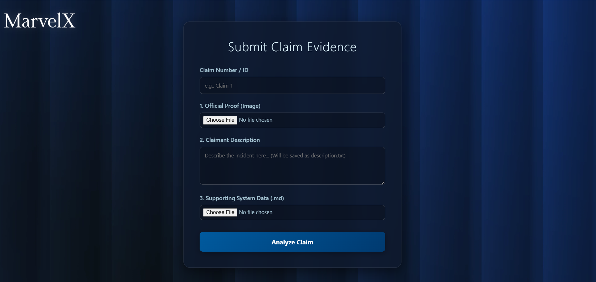
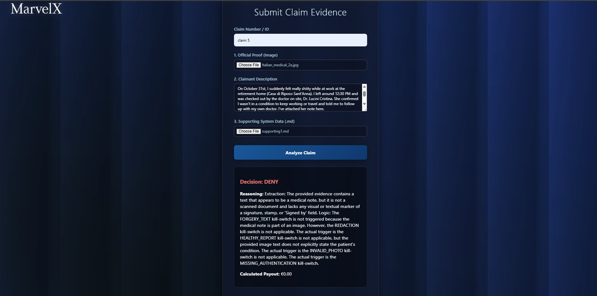
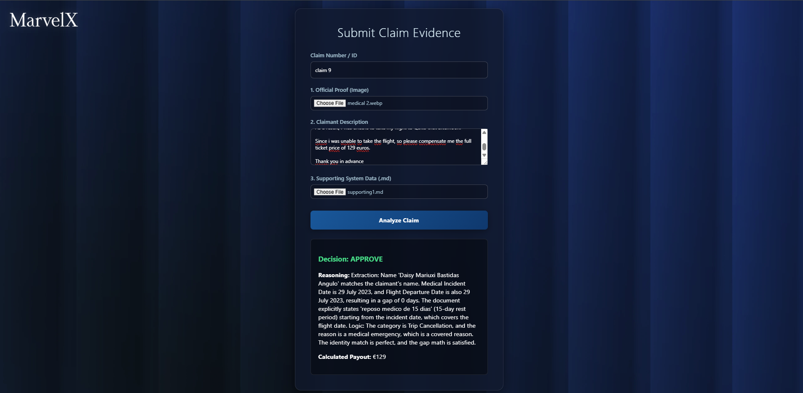

# MarvelX Forensic Claims AI

**An Intelligent Multi-Agent System for Automated Insurance Claim Verification.**

# Project Overview

`In the traditional insurance world, verifying claims is a slow, manual process prone to human error. MarvelX Forensic Claims AI leverages a collaborative multi-agent architecture to instantly analyze proof of loss, cross-reference documentation, and detect discrepancies (like date mismatches or invalid OCR data) using a forensic-first approach.`

# Key Features

* Multi-Agent Logic: Orchestrated by LangGraph, featuring a Gateman (initial screening) and an Auditor (final verification).

* Forensic OCR: Integrated EasyOCR to extract and validate text from medical notes and receipts.

* Automated Kill-Switches: Instant rejection logic for redacted documents or invalid photographic evidence.

* Modern UI: A sleek, glassmorphism-inspired web interface built with Flask.

* Transparent Reasoning: Detailed JSON-based decision logs explaining the why behind every verdict.

# How the App Works (The Backend Logic)

`The core of MarvelX is a multi-agent forensic engine. Instead of a single AI trying to do everything, the task is split between specialized "agents" using LangGraph.`

1. **Data Ingestion:** The Flask app collects the Claim ID, a text description, and two files (the "Proof" image and "Supporting" documentation).

2. **The Gateman Agent:** It uses EasyOCR to "read" the image. If it finds the image is unreadable, redacted (blacked out), or contains "kill-switch" keywords, it stops the process immediately to prevent fraud.

3. **The Auditor Agent:** If the Gateman passes the claim, the Auditor takes over. It compares the text the user typed against the text found in the documents. It looks for forensic discrepancies, such as:

- Dates that don't match.

- Names that are spelled differently.

- Inconsistent payout amounts.

**The Verdict:** The agents reach a consensus (Approve, Deny, or Uncertain) and save the full reasoning into a JSON file, which the UI then displays to you.

# The Architecture

* **The Gateman**: Acts as the first line of defense. It checks for "Kill-Switches" like poor image quality or obvious data tampering.

* **The Auditor**: Performs the deep logic. It compares the claimant’s description against the extracted proof and supporting system data.

# Installation & Setup

## Clone the repo
git clone https://github.com/Yashar7800/MarvelX-Forensic-Claims-AI.git

## Create virtual environment
python -m venv project-env
source project-env/Scripts/activate

## Install dependencies
pip install -r requirements.txt

## Run the app
python app.py

# Demo Screenshot

  

# Example Scenarios

## Denial

  

## Approval

  

